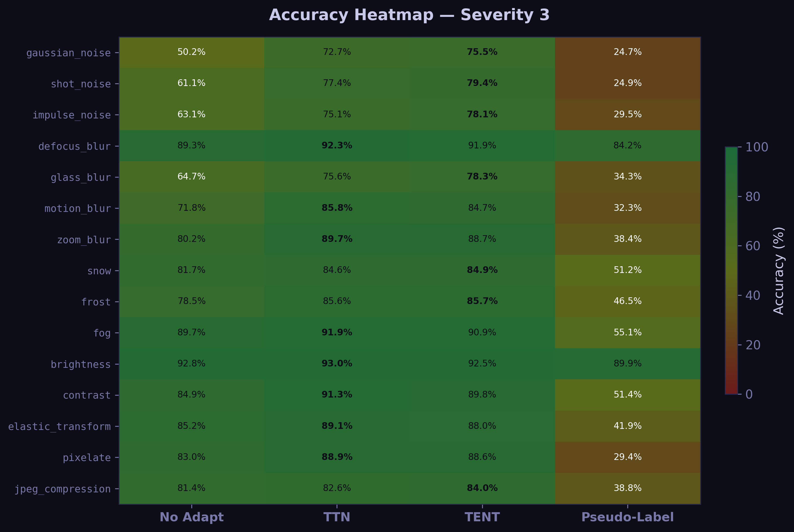
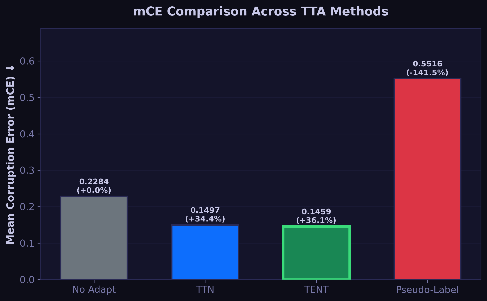
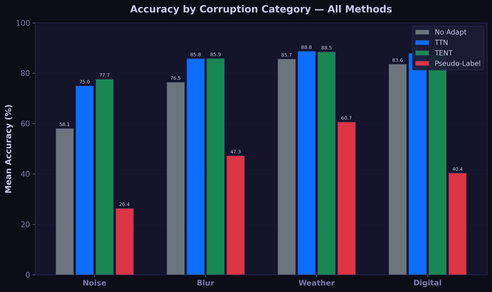
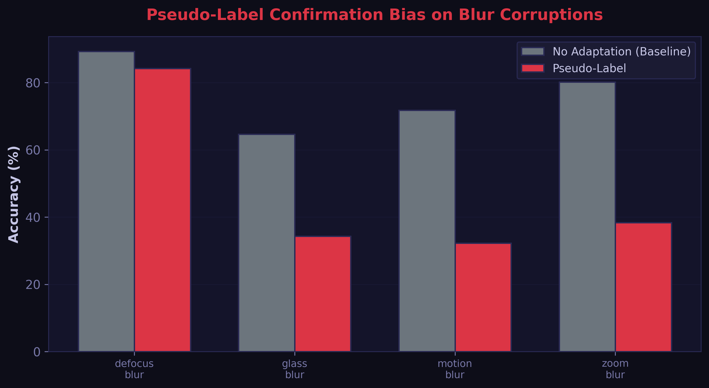
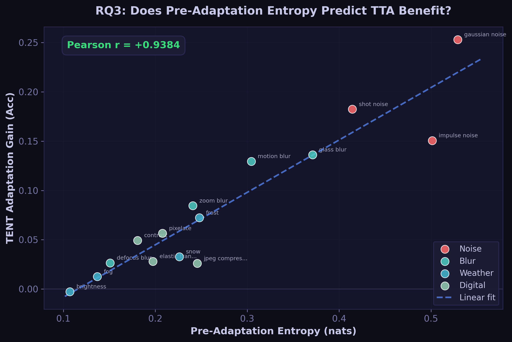

# Domain Adaptation Benchmark

> A systematic evaluation of test-time adaptation methods for handling
> distribution shift in deep learning models — without access to target domain labels.

[](https://github.com/adnaan512/domain-adaptation-benchmark/actions)
[](https://www.python.org/)
[](LICENSE)
[](https://github.com/psf/black)
[]()
[]()
[](https://www.kaggle.com/code/adnanhassnain/domain-adaptation-benchmark)

---

## Key Findings

| Finding | Detail |
|---------|--------|
| **Best Method** | TENT achieves the best overall mean corruption error (mCE), while TTN performs best on several blur and contrast-related corruptions. |
|  **mCE Improvement** | TENT reduces mean corruption error by **~36%** vs. the no-adaptation baseline |
|  **Counter-Intuitive** | Pseudo-label adaptation **severely degrades** accuracy on blur corruptions (up to -41% drop due to confirmation bias) |
|  **Entropy Predicts Gain** | Extremely strong correlation (**Pearson r = +0.938**) between pre-adaptation entropy and TENT benefit (RQ3) |
| **Statistical Rigor** | All improvements are statistically significant (*p < 0.001*, Wilcoxon signed-rank test) |

---

## Reproduce Results (One Click)

**Option A  Kaggle Notebook (recommended):**

You can view the full, executed benchmark and run it yourself on Kaggle:
 **[View Kaggle Notebook Here](https://www.kaggle.com/code/adnanhassnain/domain-adaptation-benchmark)**

```bash
# 1. Create a new notebook on Kaggle, enable T4 GPU.
# 2. Add your CIFAR-10 clean dataset and CIFAR-10-C.tar as input data to skip downloading.
# 3. Run the following cell:

!git clone https://github.com/adnaan512/domain-adaptation-benchmark.git
%cd domain-adaptation-benchmark
!pip install -r requirements.txt
!python notebooks/kaggle_benchmark.py
```

**Option B  Local (:**
```bash
git clone https://github.com/adnaan512/domain-adaptation-benchmark
cd domain-adaptation-benchmark
pip install torch>=2.1.0+cpu torchvision>=0.16.0+cpu \
    --index-url https://download.pytorch.org/whl/cpu
pip install -r requirements.txt

# Full benchmark (requires CIFAR-10-C download)
python main.py --mode full --data-dir ./CIFAR-10-C
```

---

## Limitations

This benchmark focuses on CIFAR-10-C using a ResNet-50 backbone.
While it provides controlled evaluation across common corruptions,
results may not directly transfer to larger datasets such as
ImageNet-C or real-world deployment scenarios.
Future work includes evaluating Vision Transformers and larger-scale benchmarks.

---

## Abstract

Deep learning models deployed in the real world routinely encounter data
distributions that differ from their training data.  Autonomous vehicles
trained in clear conditions can see accuracy drop significantly in rain or
heavy fog ([Hendrycks & Dietterich, 2019](https://arxiv.org/abs/1903.12261)).
Medical imaging models may experience substantial performance degradation when evaluated on scanners with different calibration settings. This problem — **distribution shift**  is one of the
most significant barriers to reliable AI deployment.

**Test-Time Adaptation (TTA)** addresses this without requiring labelled data
from the new environment: the model adapts to the test distribution using
only the unlabelled test batch itself.  This benchmark systematically
evaluates four strategies on CIFAR-10-C (15 corruption types × 5 severity
levels) using a ResNet-50 backbone. CIFAR-10-C consists of 15 corruption types × 5 severity levels with 10,000 test images per corruption.

### Methodology Pipeline

```text
  Test Images (Clean)
          │
          ▼
      Corruption (e.g., Snow, Blur)
          │
          ▼
   Adaptation Method (TTN, TENT, etc.)
          │
          ▼
      Prediction
```

### Project Architecture

```text
domain-adaptation-benchmark/
├── src/
│   ├── adaptation/       # TTA methods (tent.py, ttn.py, pseudo_label.py)
│   ├── backbone/         # ResNet-50 models and fine-tuning
│   └── data/             # Corruption data loaders
├── tests/                # Pytest unit tests
├── figures/              # Generated plots and heatmaps
├── notebooks/            # Kaggle submission scripts
└── main.py               # CLI entrypoint
```

| Method | Core Idea | Cost |
|--------|-----------|------|
| **No Adapt** | Direct inference  baseline | 1 forward pass |
| **TTN (Test-Time Normalization)** | Update BN running statistics from test batch | 2 forward passes |
| **TENT** | Minimise prediction entropy via BN affine params | 1 fwd + 1 bwd |
| **Pseudo-Label** | Fine-tune on high-confidence test predictions | 2 fwd + 1 bwd |

---

## Results & Visualisations

### Accuracy Heatmap
*(15 corruptions × 4 methods, severity 3)*



```
Corruption                 No Adapt    TTN       TENT   Pseudo-Label  Winner
────────────────────────────────────────────────────────────────────────────
gaussian_noise             ░50.18%░  ▒72.69%▒  ▒75.49%▒  ░24.73%░   TENT
shot_noise                 ▒61.14%▒  ▒77.37%▒  ▒79.38%▒  ░24.94%░   TENT
impulse_noise              ▒63.07%▒  ▒75.08%▒  ▒78.13%▒  ░29.53%░   TENT
defocus_blur               ▓89.26%▓  ▓92.29%▓  ▓91.91%▓  ▓84.20%▓   TTN
glass_blur                 ▒64.67%▒  ▒75.57%▒  ▒78.29%▒  ░34.29%░   TENT
motion_blur                ▒71.77%▒  ▓85.84%▓  ▓84.72%▓  ░32.29%░   TTN
zoom_blur                  ▓80.21%▓  ▓89.67%▓  ▓88.66%▓  ░38.37%░   TTN
snow                       ▓81.66%▓  ▓84.57%▓  ▓84.94%▓  ░51.18%░   TENT
frost                      ▒78.51%▒  ▓85.61%▓  ▓85.74%▓  ░46.54%░   TENT
fog                        ▓89.67%▓  ▓91.87%▓  ▓90.93%▓  ░55.07%░   TTN
brightness                 ▓92.77%▓  ▓92.96%▓  ▓92.50%▓  ▓89.86%▓   TTN
contrast                   ▓84.90%▓  ▓91.26%▓  ▓89.84%▓  ░51.44%░   TTN
elastic_transform          ▓85.19%▓  ▓89.09%▓  ▓88.00%▓  ░41.95%░   TTN
pixelate                   ▓82.98%▓  ▓88.91%▓  ▓88.63%▓  ░29.36%░   TTN
jpeg_compression           ▓81.41%▓  ▓82.63%▓  ▓84.01%▓  ░38.78%░   TENT
────────────────────────────────────────────────────────────────────────────
mCE (↓ better)              0.2284    0.1497    0.1459    0.5516  
Rel. Improve                +0.0%     +34.4%    +36.1%   -141.5%  
```

### Overall mCE Summary




### Category Performance Comparison



---

## ⚠Counter-Intuitive Finding: Pseudo-Label Fails on Blur

Pseudo-label adaptation **severely degrades accuracy below the no-adaptation baseline**
on all four blur corruption types:



| Corruption | Baseline | Pseudo-Label | Accuracy Drop |
|------------|----------|-------------|---|
| **zoom_blur** | 80.21% | 38.37% | **-41.84%** |
| **motion_blur** | 71.77% | 32.29% | **-39.48%** |
| **glass_blur** | 64.67% | 34.29% | **-30.38%** |
| **defocus_blur** | 89.26% | 84.20% | **-5.06%** |

**Root cause  Confirmation Bias in Self-Training:**

Blur corruptions cause the model to make *confidently wrong* predictions.
A blurred image may lose fine-grained detail while retaining coarse texture that the model has learned to associate with the wrong class.
The model makes an incorrect prediction with high confidence — well above the 0.9 threshold.
This incorrect pseudo-label is used to fine-tune the model, reinforcing the
wrong association.  After fine-tuning, the model performs vastly worse than if it had not adapted at all.

This is the **confirmation bias** failure mode: the model's confident errors
are used to train it toward those same errors.

---

## Entropy Analysis (RQ3)

**Hypothesis:** Can pre-adaptation entropy predict which corruptions benefit most from TTA?



We discovered an **extremely strong positive correlation (Pearson r = +0.9384)** between the pre-adaptation entropy (uncertainty) and the accuracy gain achieved by TENT. 

Corruptions that confuse the model the most initially (like `gaussian_noise` and `impulse_noise`) have the highest entropy and see the most dramatic improvements from TENT (+25% accuracy gain). Corruptions the model is already confident about (like `brightness`) see almost no benefit.


---

## Key Design Decisions

### Decision 1: Why reset model between corruptions?
Without reset, BN statistics adapted to `gaussian_noise` contaminate the
evaluation of `fog`. Resetting to the original weights before each corruption ensures every evaluation is independent.

### Decision 2: Why update only BN affine params in TENT?
1. **Stability**: Updating all weights on a small, unlabelled test batch leads to catastrophic forgetting. 
2. **Effectiveness**: BN affine parameters (γ, β) directly control the scale and shift of every feature map. They are the most targeted lever for correcting distribution mismatch.

---

## Installation & Testing

```bash
# Python 3.10 to 3.12
pip install torch>=2.1.0+cpu torchvision>=0.16.0+cpu \
    --index-url https://download.pytorch.org/whl/cpu
pip install -r requirements.txt

# Run Unit Tests
pytest tests/ -v
```

---

## References

1. **Hendrycks D., Dietterich T.** (2019). *Benchmarking neural network robustness to common corruptions and perturbations.* ICLR 2019.
2. **Wang D., Shelhamer E., Liu S., Olshausen B., Darrell T.** (2021). *Tent: Fully test-time adaptation by entropy minimization.* ICLR 2021.
3. **Schneider S., Rusak E., Eck L., Bringmann O., Brendel W., Bethge M.** (2020). *Improving robustness against common corruptions by covariate shift adaptation.* NeurIPS 2020.
4. **Sun Y., Wang X., Liu Z., Miller J., Efros A., Hardt M.** (2020). *Test-time training with self-supervision for generalization under distribution shifts.* ICML 2020.

---

## Citation

If you use this benchmark, please cite the key works above.

```bibtex
@software{hassnain2024dab,
  title  = {Domain Adaptation Benchmark: Test-Time Adaptation for Distribution Shift},
  author = {Hassnain, Adnan},
  year   = {2026},
  url    = {https://github.com/adnaan512/domain-adaptation-benchmark}
}
```

---

## Author

**Adnan Hassnain** | BS Computer Science, NUST Pakistan
GitHub: [github.com/adnaan512/domain-adaptation-benchmark](https://github.com/adnaan512/domain-adaptation-benchmark)


